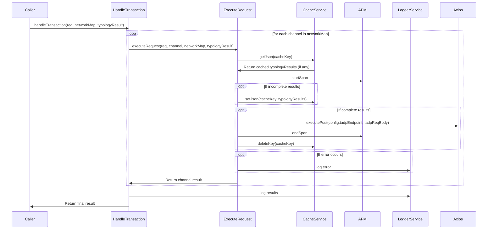

# CADProc

## Overview

Here's a brief explanation of each participant:

- Caller: This represents the starting point of the process, where the code is initially called. The Caller initiates the process by providing the required inputs (transaction request, network map, and typology result) and calling the handleTransaction function.
- HandleTransaction: This function is responsible for managing the processing of the transaction request. It iterates through each channel in the network map and calls the executeRequest function to process the transaction for each channel.
- ExecuteRequest: This function performs the main logic of the channel aggregation decisioning processor. It retrieves cached typology results, checks if the results are complete, saves interim results to the cache, and sends complete results to the TADP (Transaction Analysis and Decisioning Platform) for further processing.
- CacheService: This service is responsible for managing the caching of interim typology results. It provides methods such as getJson for retrieving cached results, setJson for saving results to the cache, and deleteKey for deleting cache keys.
- APM: The Application Performance Monitoring service is used to monitor the performance of the code execution. It starts and ends spans to measure the time taken by different parts of the code.
- LoggerService: This service is responsible for logging various events, messages, and errors that occur during the execution of the code. It helps to track the progress of the processing and diagnose any issues that may arise.
- Axios: Axios is a library used for making HTTP requests. In this case, it is used to send a POST request to the TADP endpoint with the complete channel results.

## Sequence Diagram

Here's a detailed explanation of the numbers in the sequence diagram:

1. The Caller initiates the process by calling the handleTransaction function with the required input (transaction request, network map, and typology result).
2. For each channel in the network map, the handleTransaction function calls the executeRequest function, providing the transaction request, the channel, the network map, and the typology result.
3. Inside the executeRequest function, it first retrieves any cached typology results using the getJson method from the CacheService.
4. The APM (Application Performance Monitoring) service is used to start a span for monitoring the performance of the code execution.
5. If the typology results are incomplete, the executeRequest function saves the current typology results to the cache using the setJson method from the CacheService.
6. If the typology results are complete, the executeRequest function sends a POST request to the TADP (Transaction Analysis and Decisioning Platform) endpoint using the Axios library.
7. The APM service is used again to end the span after the POST request has been sent.
8. The cache key associated with the typology results is deleted from the cache using the deleteKey method from the CacheService.
9. If an error occurs during any step of the process, the LoggerService is used to log the error message.
10. The executeRequest function returns the channel result to the handleTransaction function.
11. After processing all channels, the handleTransaction function logs the final results using the LoggerService.
12. The handleTransaction function returns the final result to the Caller.
